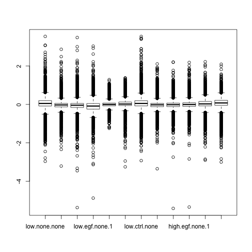

I. Data munge
========================================================
Started: Linggi Sept 23,2013   

notes:    
text in *italic* indicates response to test   
text in **Bold** indicates things to note or follow up on   

### Purpose
1.Perform initial preprocessing steps to get rid of any errors in data gathering or collection.  
2.Perform quality checks      

executed: Mon Oct  7 10:45:36 2013
  
input, raw .xls file 'ws'    
output, ws.preprocessed    
Set path to data folder


```r
setwd("/Volumes/Documents-1/R_onAir/EGF_gage analysis")
require(XLConnect)
```

```
## Loading required package: XLConnect
## Loading required package: rJava
## XLConnect 0.2-5 by Mirai Solutions GmbH
## http://www.mirai-solutions.com ,
## http://miraisolutions.wordpress.com
```

```r

# import data, in .xls form.
ws = readWorksheetFromFile("/Volumes/Documents-1/R_onAir/EGF_gage analysis/data/Seq02_density.xls", 
    sheet = 1, header = T, rownames = 1)
```

### What is the response variable? 


```r
check.resopnse.var = print(summary(ws))
```

```
##  low.none.none    high.ctrl.none    low.egf.none    low.egf.none.1  
##  Min.   :-2.958   Min.   :-3.208   Min.   :-5.366   Min.   :-4.873  
##  1st Qu.:-0.083   1st Qu.:-0.128   1st Qu.:-0.158   1st Qu.:-0.245  
##  Median : 0.050   Median :-0.028   Median :-0.042   Median :-0.085  
##  Mean   : 0.036   Mean   :-0.029   Mean   :-0.038   Mean   :-0.080  
##  3rd Qu.: 0.199   3rd Qu.: 0.056   3rd Qu.: 0.053   3rd Qu.: 0.046  
##  Max.   : 3.539   Max.   : 2.868   Max.   : 3.481   Max.   : 3.033  
##  NA's   :1        NA's   :1        NA's   :1        NA's   :1       
##   low.egf.inh      low.egf.inh.1    low.ctrl.none    high.ctrl.none.1
##  Min.   :-1.2457   Min.   :-3.248   Min.   :-2.923   Min.   :-3.348  
##  1st Qu.:-0.0745   1st Qu.:-0.059   1st Qu.:-0.077   1st Qu.:-0.118  
##  Median :-0.0028   Median : 0.020   Median : 0.051   Median :-0.021  
##  Mean   : 0.0025   Mean   : 0.030   Mean   : 0.037   Mean   :-0.022  
##  3rd Qu.: 0.0695   3rd Qu.: 0.126   3rd Qu.: 0.191   3rd Qu.: 0.056  
##  Max.   : 1.2926   Max.   : 1.381   Max.   : 3.537   Max.   : 2.108  
##  NA's   :1         NA's   :1        NA's   :1        NA's   :1       
##  high.egf.none    high.egf.none.1   high.egf.inh     high.egf.inh.1   
##  Min.   :-5.410   Min.   :-5.339   Min.   :-2.9004   Min.   :-2.9981  
##  1st Qu.:-0.113   1st Qu.:-0.099   1st Qu.:-0.0760   1st Qu.:-0.0440  
##  Median :-0.014   Median :-0.004   Median : 0.0283   Median : 0.0779  
##  Mean   :-0.017   Mean   :-0.007   Mean   : 0.0265   Mean   : 0.0623  
##  3rd Qu.: 0.069   3rd Qu.: 0.084   3rd Qu.: 0.1541   3rd Qu.: 0.2145  
##  Max.   : 2.204   Max.   : 2.185   Max.   : 2.2214   Max.   : 2.0915  
##  NA's   :1        NA's   :1        NA's   :1         NA's   :1
```

```r
response.var.answer = "Gene expression level, Z-scale normalized "  ### manual input#*
```

### Is it categorical or continuous?


```r
### 
cat.or.cont.answer = print("continuous")  ### manual input#*
```

```
## [1] "continuous"
```

### What is the range of values?


```r
response.var.range = print(range(ws$low.none.none, na.rm = T))
```

```
## [1] -2.958  3.539
```

#### Are there any outliers?


```r
response.boxplot = boxplot(ws)
```

 

*answer: some outliers in a couple of samples, but is not too dramatic. keep them there*   ### manual input  
 

```r
# do not use ws.v2 = ws[-
# which(ws$Fold.Change==(max(ws$Fold.Change,na.rm=TRUE))),]
```

recheck for other outliers

```r
# do no use response.boxplot.v2 = boxplot(ws.v2$Fold.Change)
```


#### Are there any missing values? Should they be removed?


```r
summary.ws.v2 = print(summary(ws))
```

```
##  low.none.none    high.ctrl.none    low.egf.none    low.egf.none.1  
##  Min.   :-2.958   Min.   :-3.208   Min.   :-5.366   Min.   :-4.873  
##  1st Qu.:-0.083   1st Qu.:-0.128   1st Qu.:-0.158   1st Qu.:-0.245  
##  Median : 0.050   Median :-0.028   Median :-0.042   Median :-0.085  
##  Mean   : 0.036   Mean   :-0.029   Mean   :-0.038   Mean   :-0.080  
##  3rd Qu.: 0.199   3rd Qu.: 0.056   3rd Qu.: 0.053   3rd Qu.: 0.046  
##  Max.   : 3.539   Max.   : 2.868   Max.   : 3.481   Max.   : 3.033  
##  NA's   :1        NA's   :1        NA's   :1        NA's   :1       
##   low.egf.inh      low.egf.inh.1    low.ctrl.none    high.ctrl.none.1
##  Min.   :-1.2457   Min.   :-3.248   Min.   :-2.923   Min.   :-3.348  
##  1st Qu.:-0.0745   1st Qu.:-0.059   1st Qu.:-0.077   1st Qu.:-0.118  
##  Median :-0.0028   Median : 0.020   Median : 0.051   Median :-0.021  
##  Mean   : 0.0025   Mean   : 0.030   Mean   : 0.037   Mean   :-0.022  
##  3rd Qu.: 0.0695   3rd Qu.: 0.126   3rd Qu.: 0.191   3rd Qu.: 0.056  
##  Max.   : 1.2926   Max.   : 1.381   Max.   : 3.537   Max.   : 2.108  
##  NA's   :1         NA's   :1        NA's   :1        NA's   :1       
##  high.egf.none    high.egf.none.1   high.egf.inh     high.egf.inh.1   
##  Min.   :-5.410   Min.   :-5.339   Min.   :-2.9004   Min.   :-2.9981  
##  1st Qu.:-0.113   1st Qu.:-0.099   1st Qu.:-0.0760   1st Qu.:-0.0440  
##  Median :-0.014   Median :-0.004   Median : 0.0283   Median : 0.0779  
##  Mean   :-0.017   Mean   :-0.007   Mean   : 0.0265   Mean   : 0.0623  
##  3rd Qu.: 0.069   3rd Qu.: 0.084   3rd Qu.: 0.1541   3rd Qu.: 0.2145  
##  Max.   : 2.204   Max.   : 2.185   Max.   : 2.2214   Max.   : 2.0915  
##  NA's   :1        NA's   :1        NA's   :1         NA's   :1
```

*1 nan in each column
15070
*each is at row 15070. is last row*
NA, NA, NA, NA, NA, NA, NA, NA, NA, NA, NA, NA
*remove this row*


*also remove any rows that have 'na' names, there are 1282*

*also remove rows with names with ####, there are 25 *


*the new dataset has 13762 rows


### Determine data coding 
*not necessary for this dataset, no factors to code*    

#```{r}
 data.coding.workbook=loadWorkbook('../diagnostics/levels.xls',create=TRUE)
     createSheet(data.coding.workbook,name='coding_levels')
     description=paste((date()),'diagnostics: LEVELS of column data')
     writeWorksheet(description,object=data.coding.workbook, sheet='levels', startRow=1,header=F)
     writeWorksheet(t(colnames(ws.v2)),object=data.coding.workbook, sheet='levels', startRow=3, startCol=2)
 
 for (i in  1:ncol(ws)){
        #output all levels for factors
           writeWorksheet(levels(as.factor(ws.v2[,i])), object= data.coding.workbook,sheet='levels',startCol=i+1,startRow=5,header=F)
                             }
          saveWorkbook(data.coding.workbook)
 ```
 look at 'levels.xls' in /diagnostics to determine if coding is appropriate  

             
# #### Recode variables    

  
  ```r
  ws.v2.factored = ws.v2
  ```
  
  ```
  ## Error: object 'ws.v2' not found
  ```
  
  ```r
  # make vector to id all columns to factor except response variable
  idx = 1:ncol(ws.v2)
  ```
  
  ```
  ## Error: object 'ws.v2' not found
  ```
  
  ```r
  idx = idx[-21]  # idx of response var
  ```
  
  ```
  ## Error: object 'idx' not found
  ```
  
  ```r
  for (i in idx) {
      ws.v2.factored[, i] = as.factor(ws.v2[, i])
  }
  ```
  
  ```
  ## Error: object 'idx' not found
  ```

#### Make new sheet in same .xls sheet and export summary

 
 ```r
 createSheet(data.coding.workbook, name = "levels_summary")
 ```
 
 ```
 ## Error: error in evaluating the argument 'object' in selecting a method for function 'createSheet': Error: object 'data.coding.workbook' not found
 ```
 
 ```r
 writeWorksheet(summary(ws.v2.factored), object = data.coding.workbook, sheet = "levels_summary")
 ```
 
 ```
 ## Error: error in evaluating the argument 'object' in selecting a method for function 'writeWorksheet': Error: object 'data.coding.workbook' not found
 ```
 
 ```r
 saveWorkbook(data.coding.workbook)
 ```
 
 ```
 ## Error: error in evaluating the argument 'object' in selecting a method for function 'saveWorkbook': Error: object 'data.coding.workbook' not found
 ```
 
 ```r
 # and print to console
 print(summary(ws.v2.factored))
 ```
 
 ```
 ## Error: error in evaluating the argument 'x' in selecting a method for function 'print': Error in summary(ws.v2.factored) : 
 ##   error in evaluating the argument 'object' in selecting a method for function 'summary': Error: object 'ws.v2.factored' not found
 ```


#### Output of this step of preprocessing


```r
ws.prepocessed = ws
save.image("/Volumes/Documents-1/R_onAir/EGF_gage analysis/diagnostics/Preproc.Rdata")
```
