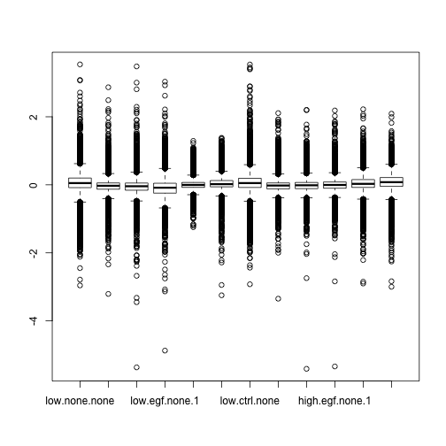
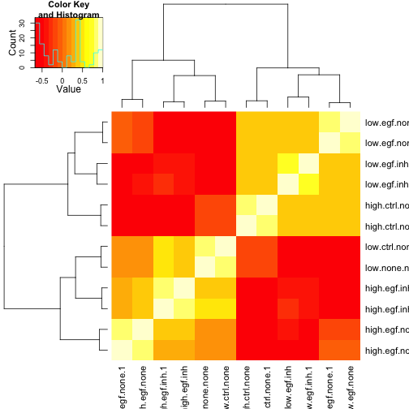

Processing Expression Data for pathway enrichment
==================

### I. Data munge

Started: Linggi Sept 23,2013   

notes:    
text in *italic* indicates response to test   
text in **Bold** indicates things to note or follow up on  
#*********** indicates area to change inputs

## Purpose
1.Perform initial preprocessing steps to get rid of any errors in data gathering or collection.  
2.Perform quality checks      

executed: Tue Oct  8 15:48:21 2013
  
input, raw .xls file 'ws'    
output, ws.preprocessed    
Set path to data folder


```r
# ************
pick.directory = "/Volumes/Documents/R_onAir/EGF_gage analysis/"
# ************
setwd(pick.directory)
require(XLConnect)
```

```
## Loading required package: XLConnect
## Loading required package: rJava
## XLConnect 0.2-5 by Mirai Solutions GmbH
## http://www.mirai-solutions.com ,
## http://miraisolutions.wordpress.com
```

```r

# import data, in .xls form. ************
ws = readWorksheetFromFile("/Volumes/Documents/R_onAir/EGF_gage analysis/data/Seq02_density.xls", 
    sheet = 1, header = T, rownames = 1)
# ************
```

### What is the response variable? 


```r
check.resopnse.var = print(summary(ws))
```

```
##  low.none.none    high.ctrl.none    low.egf.none    low.egf.none.1  
##  Min.   :-2.958   Min.   :-3.208   Min.   :-5.366   Min.   :-4.873  
##  1st Qu.:-0.083   1st Qu.:-0.128   1st Qu.:-0.158   1st Qu.:-0.245  
##  Median : 0.050   Median :-0.028   Median :-0.042   Median :-0.085  
##  Mean   : 0.036   Mean   :-0.029   Mean   :-0.038   Mean   :-0.080  
##  3rd Qu.: 0.199   3rd Qu.: 0.056   3rd Qu.: 0.053   3rd Qu.: 0.046  
##  Max.   : 3.539   Max.   : 2.868   Max.   : 3.481   Max.   : 3.033  
##  NA's   :1        NA's   :1        NA's   :1        NA's   :1       
##   low.egf.inh      low.egf.inh.1    low.ctrl.none    high.ctrl.none.1
##  Min.   :-1.2457   Min.   :-3.248   Min.   :-2.923   Min.   :-3.348  
##  1st Qu.:-0.0745   1st Qu.:-0.059   1st Qu.:-0.077   1st Qu.:-0.118  
##  Median :-0.0028   Median : 0.020   Median : 0.051   Median :-0.021  
##  Mean   : 0.0025   Mean   : 0.030   Mean   : 0.037   Mean   :-0.022  
##  3rd Qu.: 0.0695   3rd Qu.: 0.126   3rd Qu.: 0.191   3rd Qu.: 0.056  
##  Max.   : 1.2926   Max.   : 1.381   Max.   : 3.537   Max.   : 2.108  
##  NA's   :1         NA's   :1        NA's   :1        NA's   :1       
##  high.egf.none    high.egf.none.1   high.egf.inh     high.egf.inh.1   
##  Min.   :-5.410   Min.   :-5.339   Min.   :-2.9004   Min.   :-2.9981  
##  1st Qu.:-0.113   1st Qu.:-0.099   1st Qu.:-0.0760   1st Qu.:-0.0440  
##  Median :-0.014   Median :-0.004   Median : 0.0283   Median : 0.0779  
##  Mean   :-0.017   Mean   :-0.007   Mean   : 0.0265   Mean   : 0.0623  
##  3rd Qu.: 0.069   3rd Qu.: 0.084   3rd Qu.: 0.1541   3rd Qu.: 0.2145  
##  Max.   : 2.204   Max.   : 2.185   Max.   : 2.2214   Max.   : 2.0915  
##  NA's   :1        NA's   :1        NA's   :1         NA's   :1
```

```r
# ************
response.var.answer = "Gene expression level, Z-scale normalized "  ### manual input#*
```

### Is it categorical or continuous?


```r
### ************
cat.or.cont.answer = print("continuous")  ### manual input#*
```

```
## [1] "continuous"
```

### What is the range of values?


```r
response.var.range = print(range(ws$low.none.none, na.rm = T))
```

```
## [1] -2.958  3.539
```

#### Are there any outliers?


```r
response.boxplot = boxplot(ws)
```

 

*answer: some outliers in a couple of samples, but is not too dramatic. keep them there*   ### manual input  
 

```r
# do not use ws.v2 = ws[-
# which(ws$Fold.Change==(max(ws$Fold.Change,na.rm=TRUE))),]
```

recheck for other outliers

```r
# do no use response.boxplot.v2 = boxplot(ws.v2$Fold.Change)
```


#### Are there any missing values? Should they be removed?


```r
summary.ws.v2 = print(summary(ws))
```

```
##  low.none.none    high.ctrl.none    low.egf.none    low.egf.none.1  
##  Min.   :-2.958   Min.   :-3.208   Min.   :-5.366   Min.   :-4.873  
##  1st Qu.:-0.083   1st Qu.:-0.128   1st Qu.:-0.158   1st Qu.:-0.245  
##  Median : 0.050   Median :-0.028   Median :-0.042   Median :-0.085  
##  Mean   : 0.036   Mean   :-0.029   Mean   :-0.038   Mean   :-0.080  
##  3rd Qu.: 0.199   3rd Qu.: 0.056   3rd Qu.: 0.053   3rd Qu.: 0.046  
##  Max.   : 3.539   Max.   : 2.868   Max.   : 3.481   Max.   : 3.033  
##  NA's   :1        NA's   :1        NA's   :1        NA's   :1       
##   low.egf.inh      low.egf.inh.1    low.ctrl.none    high.ctrl.none.1
##  Min.   :-1.2457   Min.   :-3.248   Min.   :-2.923   Min.   :-3.348  
##  1st Qu.:-0.0745   1st Qu.:-0.059   1st Qu.:-0.077   1st Qu.:-0.118  
##  Median :-0.0028   Median : 0.020   Median : 0.051   Median :-0.021  
##  Mean   : 0.0025   Mean   : 0.030   Mean   : 0.037   Mean   :-0.022  
##  3rd Qu.: 0.0695   3rd Qu.: 0.126   3rd Qu.: 0.191   3rd Qu.: 0.056  
##  Max.   : 1.2926   Max.   : 1.381   Max.   : 3.537   Max.   : 2.108  
##  NA's   :1         NA's   :1        NA's   :1        NA's   :1       
##  high.egf.none    high.egf.none.1   high.egf.inh     high.egf.inh.1   
##  Min.   :-5.410   Min.   :-5.339   Min.   :-2.9004   Min.   :-2.9981  
##  1st Qu.:-0.113   1st Qu.:-0.099   1st Qu.:-0.0760   1st Qu.:-0.0440  
##  Median :-0.014   Median :-0.004   Median : 0.0283   Median : 0.0779  
##  Mean   :-0.017   Mean   :-0.007   Mean   : 0.0265   Mean   : 0.0623  
##  3rd Qu.: 0.069   3rd Qu.: 0.084   3rd Qu.: 0.1541   3rd Qu.: 0.2145  
##  Max.   : 2.204   Max.   : 2.185   Max.   : 2.2214   Max.   : 2.0915  
##  NA's   :1        NA's   :1        NA's   :1         NA's   :1
```

```r
# 1 nan in each column ************
which(is.na(ws[, 12]))
```

```
## [1] 15070
```

```r
# *each is at row 15070. is last row*
ws[15070, ]
```

```
##       low.none.none high.ctrl.none low.egf.none low.egf.none.1 low.egf.inh
## 'nan'            NA             NA           NA             NA          NA
##       low.egf.inh.1 low.ctrl.none high.ctrl.none.1 high.egf.none
## 'nan'            NA            NA               NA            NA
##       high.egf.none.1 high.egf.inh high.egf.inh.1
## 'nan'              NA           NA             NA
```

```r
# ************ *remove this row*
ws = ws[-15070, ]

# *also remove any rows that have 'na' names, there are 1282*
ws = ws[-(grep("na.", rownames(ws), ignore.case = F)), ]
# *also remove rows with names with ####, there are 25 *
ws = ws[-(grep("###", rownames(ws), ignore.case = F)), ]

# *the new dataset has
nrow(ws)
```

```
## [1] 13762
```

```r
# rows

### Determine data coding *not necessary for this dataset, no factors to code*

# ```{r}
# data.coding.workbook=loadWorkbook('../diagnostics/levels.xls',create=TRUE)
# createSheet(data.coding.workbook,name='coding_levels')
# description=paste((date()),'diagnostics: LEVELS of column data')
# writeWorksheet(description,object=data.coding.workbook, sheet='levels',
# startRow=1,header=F)
# writeWorksheet(t(colnames(ws.v2)),object=data.coding.workbook,
# sheet='levels', startRow=3, startCol=2) for (i in 1:ncol(ws)){ #output all
# levels for factors writeWorksheet(levels(as.factor(ws.v2[,i])), object=
# data.coding.workbook,sheet='levels',startCol=i+1,startRow=5,header=F) }
# saveWorkbook(data.coding.workbook) ``` look at 'levels.xls' in
# /diagnostics to determine if coding is appropriate # #### Recode variables
# ```{r} #ws.v2.factored=ws.v2 # make vector to id all columns to factor
# except response variable idx=1:ncol(ws.v2) idx = idx[-21] # idx of
# response var for (i in idx) { ws.v2.factored[,i] = as.factor(ws.v2[,i]) }
# ``` #### Make new sheet in same .xls sheet and export summary ```{r}
# createSheet(data.coding.workbook,name='levels_summary')
# writeWorksheet(summary(ws.v2.factored),object=data.coding.workbook,sheet='levels_summary')
# saveWorkbook(data.coding.workbook) # and print to console
# print(summary(ws.v2.factored)) ``` #### Output of this step of
# preprocessing

# ```{r} save.image('/Volumes/Documents-1/R_onAir/EGF_gage
# analysis/diagnostics/Preproc.Rdata')
```


### II. Initial analysis, differential expression data

Created: Oct 7, 2013, Bryan Linggi  
 
input: prerocessed data . load R.data from diagnostics folder
output: plots to identify general trends or problems in data    


```r
require(gplots)
```

```
## Loading required package: gplots
## Loading required package: gtools
## Loading required package: gdata
## gdata: read.xls support for 'XLS' (Excel 97-2004) files ENABLED.
## 
## gdata: read.xls support for 'XLSX' (Excel 2007+) files ENABLED.
## 
## Attaching package: 'gdata'
## 
## The following object is masked from 'package:stats':
## 
##     nobs
## 
## The following object is masked from 'package:utils':
## 
##     object.size
## 
## Loading required package: caTools
## Loading required package: grid
## Loading required package: KernSmooth
## KernSmooth 2.23 loaded
## Copyright M. P. Wand 1997-2009
## Loading required package: MASS
## 
## Attaching package: 'gplots'
## 
## The following object is masked from 'package:stats':
## 
##     lowess
```

```r

# check correlation between pairs of replicates using scatter plot pairs(ws,
# cex.labels=.5, pch=20)--COMMENT OUT TO SAVE TIME IN TESTING check
# correlation using cor

heatmap.2(cor(ws), trace = "none")
```

 

* replicates have high correlation (could do cor function also)  
  
* need to relable the 'low.none.none' to 'low.ctrl.none'  


```r
colnames(ws)
```

```
##  [1] "low.none.none"    "high.ctrl.none"   "low.egf.none"    
##  [4] "low.egf.none.1"   "low.egf.inh"      "low.egf.inh.1"   
##  [7] "low.ctrl.none"    "high.ctrl.none.1" "high.egf.none"   
## [10] "high.egf.none.1"  "high.egf.inh"     "high.egf.inh.1"
```

```r
# ************
colnames(ws)[1] = "low.ctrl.none.1"
colnames(ws)
```

```
##  [1] "low.ctrl.none.1"  "high.ctrl.none"   "low.egf.none"    
##  [4] "low.egf.none.1"   "low.egf.inh"      "low.egf.inh.1"   
##  [7] "low.ctrl.none"    "high.ctrl.none.1" "high.egf.none"   
## [10] "high.egf.none.1"  "high.egf.inh"     "high.egf.inh.1"
```

### Perform some tests between conditions   

```r
# ************
mean.low.ctrl.none = rowMeans(ws[, grep("low.ctrl.none", colnames(ws))])
mean.low.egf.none = rowMeans(ws[, grep("low.egf.none", colnames(ws))])
mean.low.egf.inh = rowMeans(ws[, grep("low.egf.inh", colnames(ws))])
# ************

# mean.low.ctrl.inh =
# rowMeans(ws[,grep('low.ctrl.inh',colnames(ws))])--control was not done
# plot(ws[,1],ws[,7]) ************
plot(mean.low.ctrl.none, mean.low.egf.none, main = "EGF effect on low density")
```

 


#### Output   
*use ws files still*

### III. Gage pipeline, Step I- calcs

Started: Bryan Linggi October 2, 2013  
Updated:  
Input: Preprocessed data. 'Preproc.Rdata' from 'diagnostics'  
Output: results of gage      

[link to Gage manuscript](http://www.biomedcentral.com/1471-2105/10/161) 


### Get pathway library   
if is new pathway library, make in separate script and test

```r
require("gage")
```

```
## Loading required package: gage
```

```r
# data(go.gs) ************
data(kegg.gs)
data(egSymb)
# make library generic for next steps ************
path.lib = kegg.gs  #** kegg.gs
# convert entrez to sym * note that will not work if not using appropriate
# conversion (see in pathview function also) ************
path.lib = lapply(path.lib, eg2sym)
```


```r
# WARNING: row names and data must be correct for the next line

# for this data only, need to get rid of bracketint ' ' ' ************
row.names(ws) = sub("'", "", sub("'", "", row.names(ws)))
data.G1 = as.matrix(ws)

# identify control and test column for comparison **************
control.idx = grep("high.ctrl.none", colnames(data.G1), ignore.case = T)  #***
test.idx = grep("high.egf.none", colnames(data.G1), ignore.case = T)  #***
# ************** check
check.control = print(colnames(data.G1)[control.idx])
```

```
## [1] "high.ctrl.none"   "high.ctrl.none.1"
```

```r
check.treatment = print(colnames(data.G1)[test.idx])
```

```
## [1] "high.egf.none"   "high.egf.none.1"
```

** gernalized from here on **

#### Gage analysis

```r
# *********** options: called answers
ans.same.dir = F
ans.use.fold = F  # or F is t-statistic
ans.rank.test = F
ans.ref = control.idx
ans.samp = test.idx
ans.saaTest = gs.KSTest  # non-parametric
ans.use.stouffer = T  # p-value normalization method
ans.compare = "as.group"  # 'paired', 'unpaired', '1ongroup','as.group'
# ********** create variable to capture options
filename.desc = paste(check.control, check.treatment, ans.same.dir, ans.use.fold, 
    ans.rank.test, ans.use.stouffer, ans.compare, sep = "_")
# this makes 2 characters. use only 1 TODO fix

gage.run <- gage(data.G1, gsets = path.lib, ref = ans.ref, samp = ans.samp, 
    same.dir = ans.same.dir, use.fold = ans.use.fold, rank.test = ans.rank.test, 
    saaTest = ans.saaTest, compare = ans.compare, use.stouffer = ans.use.stouffer)

# to select essential genes in group# these are used in KeggVis.Rmd for
# pathway viewing
essential.greater <- esset.grp(gage.run$greater, data.G1, gsets = path.lib, 
    ref = ans.ref, samp = ans.samp, output = F, make.plot = F, compare = ans.compare, 
    test4up = T, samedir = ans.same.dir, use.fold = ans.use.fold)

essential.less <- esset.grp(gage.run$less, data.G1, gsets = path.lib, ref = ans.ref, 
    samp = ans.samp, output = F, make.plot = F, compare = ans.compare, test4up = T, 
    samedir = ans.same.dir, use.fold = ans.use.fold)  ##TODO figure out why is NULL
```

```
## Warning: is.na() applied to non-(list or vector) of type 'NULL'
```

```
## Error: There are less than 1 significant gene set, try to increase the
## cutoff (P-value)
```

### output  
1)"gage.run" has the tables 'greater' and 'less', and 'stats' that show the diff pathways    
2) essential.greater and essential.less have the pathways that are regulated higher (greater) or lower (less) than controls #TODO figure this out    
  a) use these as inputs to Kegg.Vis if kegg is use for pathway analysis. TODO, map to other pathways types?   
  b) each of these has lists that are the core and essential gene groups (see Vignette)      
3) output this as a table

```r
# write output to local graphs directory
write.table(rbind(head(gage.run$greater), head(gage.run$less)), file = paste("./graphs/", 
    filename.desc[1], ".xls", sep = ""), sep = "\t")
```

```
## Warning: cannot open file
## './graphs/high.ctrl.none_high.egf.none_FALSE_FALSE_FALSE_TRUE_as.group.xls':
## No such file or directory
```

```
## Error: cannot open the connection
```


### IV. Gage step 2

started October 4 ,2013
Bryan Linggi  
Purpose: To filter differential pathway expression results    

input: R.data from Gage Step1, which contains the results of the analysis, analysis.1, gene set definitions (kegg)
output: filtered output , heatmaps?  

#### Heatmap

```r
#### process analysis to remove redundant genes from gene sets

# convert entrez to symbol

# create heatmap, heatmap-sends to local /reports folder
summary.regulated = sigGeneSet(gage.run, heatmap = 1, pdf.size = c(8, 8), qpval = "q.val", 
    cutoff = 0.01)  #TODO change formatting of heatmap, TODO matrix error here
```

```
## [1] "gs.data needs to be a matrix-like object!"
## [1] "gs.data needs to be a matrix-like object!"
## [1] "there are 15 signficantly two-direction perturbed gene sets"
```

```r

# heatmap of genes that change in each gene list pick how many to print
# *******
print.top = 3
# *******
genes.print = unique(unlist(path.lib[rownames(gage.run$greater)[1:print.top]]))
genes.print.data = essGene(genes.print, data.G1, ref = ans.ref, samp = ans.samp)
for (gs in rownames(gage.run$greater)[1:print.top]) {
    outname = gs
    # numbering of these colums is different from original. Refs are 1st half,
    # samples are second half******check this for each expt
    geneData(genes = path.lib[[gs]], exprs = genes.print.data, ref = ans.ref, 
        samp = ans.samp, txt = T, heatmap = T, Colv = F, Rowv = F, dendrogram = "none", 
        outname = gs, limit = 3, scatterplot = F)
}  #TODO error here
```

```
## Error: subscript out of bounds
```

### V. Visualization of pathways with regulated nodes
Started: October 4, 2013     
By Bryan Linggi     

input: R.data file that has gage analysis results    
output: .png file with graphs in local folder *need to specify  

TODO: push graph output to html

### Pathway Visualization
#### Kegg


```r
source("http://bioconductor.org/biocLite.R")
```

```
## Bioconductor version 2.12 (BiocInstaller 1.10.3), ?biocLite for help
```

```r
biocLite("pathview")
```

```
## BioC_mirror: http://bioconductor.org
## Using Bioconductor version 2.12 (BiocInstaller 1.10.3), R version 3.0.1.
## Installing package(s) 'pathview'
```

```
## 
## The downloaded binary packages are in
## 	/var/folders/bx/_w1zt2lx4vs9cywrhjjlk6xdgnbh7z/T//RtmpolQRTN/downloaded_packages
```

```r

# location to export graphs
setwd("./graphs/")
```

```
## Error: cannot change working directory
```

```r


# input is 'essential.greater' from gage_step1.Rmd

# ** make local folder to save these graphs ***********
dir.create("./high")
# ***********
setwd("./high")
# enter as many as I want to graph ***********
ans.path.ids = c(essential.greater$essentialSets[[3]])
# ***********
path.ids = ans.path.ids
path.ids2 <- substr(path.ids, 1, 8)
# native KEGG view
ans.kegg.native = F  # **F = Curve KEGG format, T= traiditional Kegg (for some pathways, will only print traditinoal)
require(pathview)
```

```
## Loading required package: pathview
## Loading required package: KEGGgraph
## Loading required package: XML
## Loading required package: graph
## 
## Attaching package: 'graph'
## 
## The following object is masked from 'package:XML':
## 
##     addNode
## 
## Loading required package: org.Hs.eg.db
## Loading required package: AnnotationDbi
## Loading required package: BiocGenerics
## Loading required package: parallel
## 
## Attaching package: 'BiocGenerics'
## 
## The following objects are masked from 'package:parallel':
## 
##     clusterApply, clusterApplyLB, clusterCall, clusterEvalQ,
##     clusterExport, clusterMap, parApply, parCapply, parLapply,
##     parLapplyLB, parRapply, parSapply, parSapplyLB
## 
## The following object is masked from 'package:gdata':
## 
##     combine
## 
## The following object is masked from 'package:rJava':
## 
##     anyDuplicated, duplicated, sort, unique
## 
## The following object is masked from 'package:stats':
## 
##     xtabs
## 
## The following objects are masked from 'package:base':
## 
##     anyDuplicated, as.data.frame, cbind, colnames, duplicated,
##     eval, Filter, Find, get, intersect, lapply, Map, mapply,
##     match, mget, order, paste, pmax, pmax.int, pmin, pmin.int,
##     Position, rank, rbind, Reduce, rep.int, rownames, sapply,
##     setdiff, sort, table, tapply, union, unique, unlist
## 
## Loading required package: Biobase
## Welcome to Bioconductor
## 
##     Vignettes contain introductory material; view with
##     'browseVignettes()'. To cite Bioconductor, see
##     'citation("Biobase")', and for packages 'citation("pkgname")'.
## 
## 
## Attaching package: 'AnnotationDbi'
## 
## The following object is masked from 'package:MASS':
## 
##     select
## 
## Loading required package: DBI
## 
## ##############################################################################
## Pathview is an open source software package distributed under GNU General
## Public License version 3 (GPLv3). Details of GPLv3 is available at
## http://www.gnu.org/licenses/gpl-3.0.html.
## 
## The pathview downloads and uses KEGG data. Academic users may freely use the
## KEGG website at http://www.kegg.jp/ or its mirror site at GenomeNet
## http://www.genome.jp/kegg/. Academic users may also freely link to the KEGG
## website. Non-academic users may use the KEGG website as end users for
## non-commercial purposes, but any other use requires a license agreement
## (details at http://www.kegg.jp/kegg/legal.html).
## ##############################################################################
```

```r
# get differences compared to control
data.output <- data.G1[, ans.samp] - data.G1[, ans.ref]
mean.data.output = rowMeans(data.output)
pv.out.list <- sapply(path.ids2, function(pid) pathview(gene.data = mean.data.output, 
    gene.idtype = "symbol", pathway.id = pid, species = "hsa", kegg.native = ans.kegg.native, 
    sign.pos = "bottomleft"))  #*note gene.idtype
```

```
## [1] "Downloading xml files for hsa04110, 1/1 pathways.."
## [1] "Downloading png files for hsa04110, 1/1 pathways.."
```

```
## Working in directory /Volumes/Documents/R_onAir/EGF_gage analysis/src/high
## Writing image file hsa04110.pathview.pdf
```

