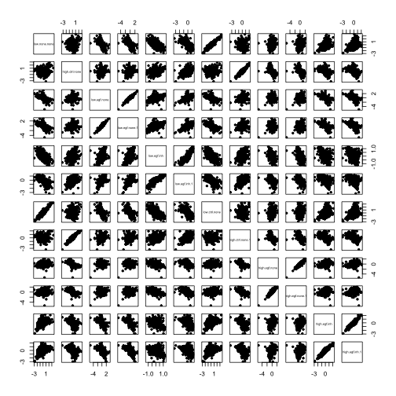
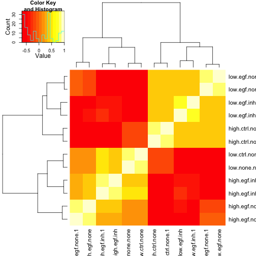
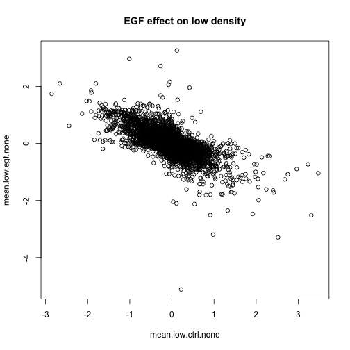

Initial analysis, differential expression data
========================================================
Created: Oct 7, 2013, Bryan Linggi  
 
input: prerocessed data . load R.data from diagnostics folder
output: plots to identify general trends or problems in data    

executed: Mon Oct  7 12:33:02 2013  


```r
setwd("/Volumes/Documents-1/R_onAir/EGF_gage analysis/")
load(file = "diagnostics/Preproc.Rdata")
# check correlation between pairs of replicates using scatter plot
pairs(ws, cex.labels = 0.5, pch = 20)
# check correlation using cor
require(gplots)
```

```
## Loading required package: gplots
## Loading required package: gtools
## Loading required package: gdata
## gdata: read.xls support for 'XLS' (Excel 97-2004) files ENABLED.
## 
## gdata: read.xls support for 'XLSX' (Excel 2007+) files ENABLED.
## 
## Attaching package: 'gdata'
## 
## The following object is masked from 'package:stats':
## 
##     nobs
## 
## The following object is masked from 'package:utils':
## 
##     object.size
## 
## Loading required package: caTools
## Loading required package: grid
## Loading required package: KernSmooth
## KernSmooth 2.23 loaded
## Copyright M. P. Wand 1997-2009
## Loading required package: MASS
## 
## Attaching package: 'gplots'
## 
## The following object is masked from 'package:stats':
## 
##     lowess
```

 

```r
heatmap.2(cor(ws), trace = "none")
```

 

* replicates have high correlation (could do cor function also)  
  
* need to relable the 'low.none.none' to 'low.ctrl.none'  


```r
colnames(ws)
```

```
##  [1] "low.none.none"    "high.ctrl.none"   "low.egf.none"    
##  [4] "low.egf.none.1"   "low.egf.inh"      "low.egf.inh.1"   
##  [7] "low.ctrl.none"    "high.ctrl.none.1" "high.egf.none"   
## [10] "high.egf.none.1"  "high.egf.inh"     "high.egf.inh.1"
```

```r
colnames(ws)[1] = "low.ctrl.none.1"
colnames(ws)
```

```
##  [1] "low.ctrl.none.1"  "high.ctrl.none"   "low.egf.none"    
##  [4] "low.egf.none.1"   "low.egf.inh"      "low.egf.inh.1"   
##  [7] "low.ctrl.none"    "high.ctrl.none.1" "high.egf.none"   
## [10] "high.egf.none.1"  "high.egf.inh"     "high.egf.inh.1"
```

### Perform some tests between conditions   

```r
mean.low.ctrl.none = rowMeans(ws[, grep("low.ctrl.none", colnames(ws))])
mean.low.egf.none = rowMeans(ws[, grep("low.egf.none", colnames(ws))])
mean.low.egf.inh = rowMeans(ws[, grep("low.egf.inh", colnames(ws))])

# mean.low.ctrl.inh =
# rowMeans(ws[,grep('low.ctrl.inh',colnames(ws))])--control was not done
# plot(ws[,1],ws[,7])
plot(mean.low.ctrl.none, mean.low.egf.none, main = "EGF effect on low density")
```

 


### Output   
use ws files still

```r
save.image("/Volumes/Documents-1/R_onAir/EGF_gage analysis/tests/init_analysis_output.Rdata")
```
